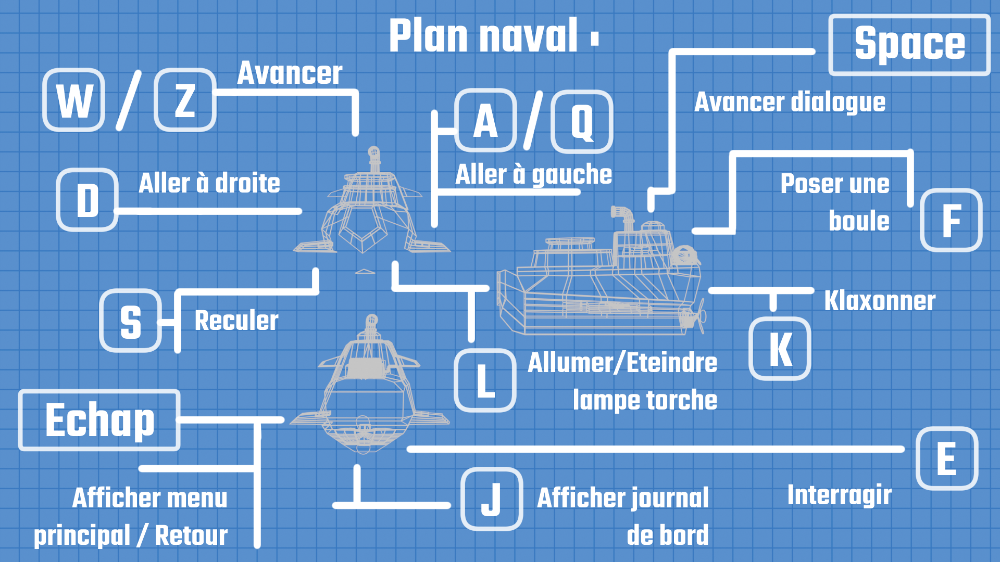

# GoW-2025-Yellow-Submarine
Ce projet participe à **Games on Web 2025 : "Dreamland"**

**Membres de l'équipe** : Oscar BELKADI, Moktar EL SHERIF, Omar ABOUDOU  
**Lien du jeu** : **[Yellow Submarine ](https://moktarels.github.io/YellowSubmarine/)**

---

## 📖 Présentation
**Yellow Submarine** est un jeu d'exploration et de résolution d'énigmes dans un univers marin onirique. 
À bord de votre sous-marin jaune, parcourez une mer mystérieuse parsemée d’îles énigmatiques aux habitants plus spéciaux les uns que les autres.

---
## 🛞 Lien avec DreamLand
Pour rester fidèle à l’univers de Dreamland, nous avons voulu créer un monde à la fois absurde et déconcertant, peuplé d’habitants étranges et composé d’îles aux apparences très distinctes les unes des autres. 
Malgré cette apparente incohérence, un fil rouge se tisse peu à peu grâce à une énigme centrale, guidant le joueur à travers cet univers onirique. Le tout mène à une fin spécial, comme finirait un rêve.

---
## 💡Nos Inspiration 
Nous voulions un jeu mélant exploration et énigme de manière à toucher un publique très large.
L'idée nous est venue grâce à un jeu nommé **Outer Wilds**. Ce jeu consiste à résoudre une énigme à grande échelle dans un systeme solaire.
C'est un jeu avec peu de mécanique de gameplay et touche un publique large avec une histoire incroyable. Nous avons fait ce jeu pour essayer de redonner aux joueurs
l'envie de jouer à des petits jeux indépendants. La plus part des jeux sont maintenant des jeux compétitifs en ligne et nous voulions redonner l'envie de découvrir des jeux à ces joueurs.

---
## 🎮 Comment jouer

---
## 🎬 Vidéo Demo
**Lien de la vidéo de démonstration** : **[Video](https://www.youtube.com/watch?v=wBYCATtGSws)**.

